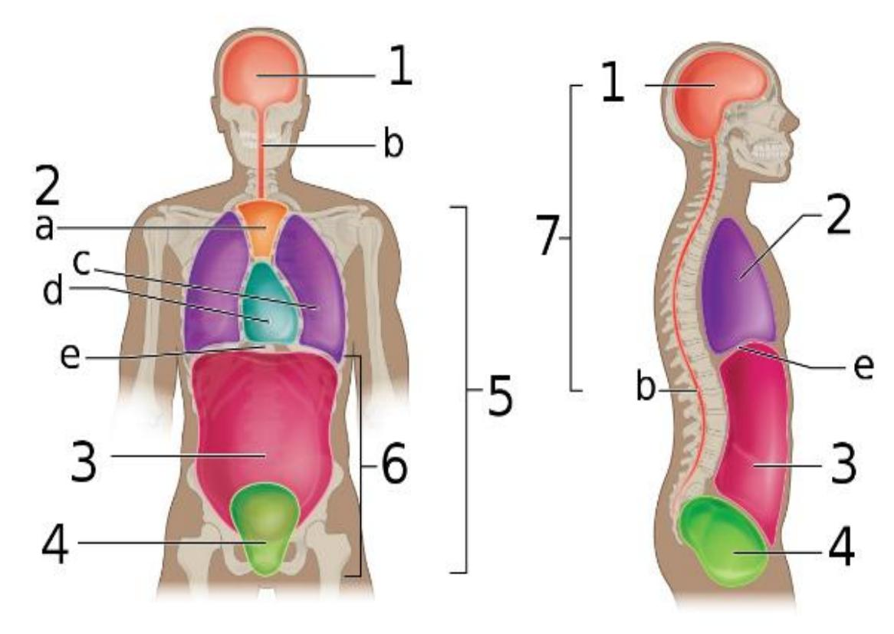
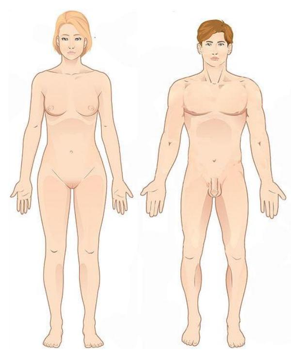
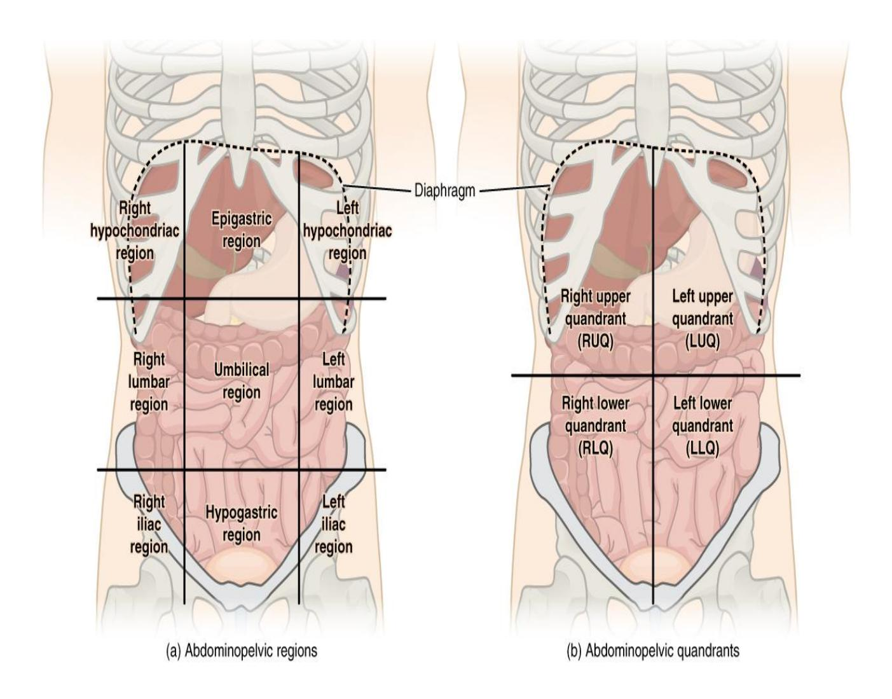
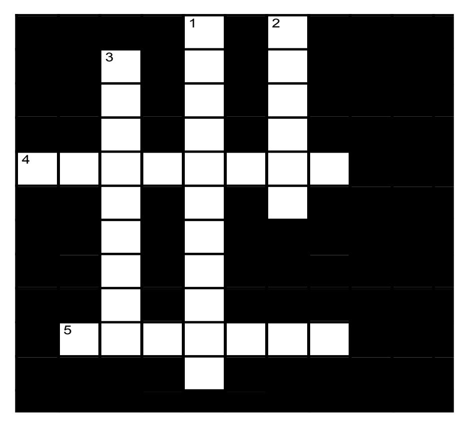

# Anatomical Language – Completed Answers

## Prelab Activity 1.1 – Definitions

### Directional Terms

| Term | Definition |
|---|---|
| Anterior (or ventral) | Toward the front of the body; in front of |
| Posterior (or dorsal) | Toward the back of the body; behind |
| Superior (or cranial) | Toward the head or upper part of a structure |
| Inferior (or caudal) | Away from the head; toward the feet or lower part |
| Lateral | Away from the midline of the body |
| Medial | Toward or at the midline of the body |
| Proximal | Closer to the point of attachment to the trunk |
| Distal | Farther from the point of attachment to the trunk |
| Superficial | Toward or at the body surface |
| Deep | Away from the body surface; more internal |

### Body Cavities

| Term | Definition |
|---|---|
| Cranial | Cavity within the skull that encloses the brain |
| Abdominal | Portion of the ventral cavity inferior to the diaphragm |
| Pericardial | Fluid-filled cavity surrounding the heart |
| Pleural | Cavities surrounding the lungs |
| Ventral | Anterior body cavity containing thoracic and abdominopelvic cavities |

### Body Planes

| Term | Definition |
|---|---|
| Sagittal plane | Divides the body into right and left portions |
| Midsagittal plane | Divides the body into equal right and left halves |
| Parasagittal plane | Divides the body into unequal right and left portions |
| Frontal plane | Divides the body into anterior and posterior portions |
| Transverse plane | Divides the body into superior and inferior portions |
| Oblique plane | Plane passing through the body at an angle |

---

## Prelab Activity 1.2 – Identification

(Figure-dependent answers cannot be reliably completed without the image labels.)

---

## Prelab Activity 1.3 – Organ Systems

| Organ System | Function | Organs |
|---|---|---|
| 1. Integumentary | Protects body and regulates temperature | Skin, hair, nails, sweat glands |
| 2. Skeletal | Support, protection, blood cell formation | Bones, cartilage, ligaments |
| 3. Muscular | Movement and heat production | Skeletal muscles, tendons |
| 4. Nervous | Fast-acting control system | Brain, spinal cord, nerves |
| 5. Endocrine | Hormone secretion | Pituitary, thyroid, adrenal glands |
| 6. Cardiovascular | Transports blood | Heart, blood vessels |
| 7. Lymphatic | Immunity and fluid return | Lymph nodes, spleen, thymus |
| 8. Respiratory | Gas exchange | Lungs, trachea, bronchi |
| 9. Digestive | Breaks down food | Stomach, intestines, liver |
| 10. Urinary | Eliminates wastes | Kidneys, bladder, ureters |
| 11a. Male Reproductive | Produces sperm | Testes, penis, prostate |
| 11b. Female Reproductive | Produces eggs and supports fetus | Ovaries, uterus, vagina |

---

# Lab Activity 1.1 – Anatomical Terminology

## Anatomical Position

Body standing upright facing forward, arms at sides, palms forward,
feet slightly apart.

## Prone Position

Body lying face down.

## Supine Position

Body lying face up.

---

# Lab Activity 1.4 – Applying Anatomical and Regional Terminology

1. The elbow is located **proximal** to the wrist.

2. The umbilicus is located **inferior** to the sternum.

3. The nose is located **medial** to the ears.

4. The mouth is located **superior** to the chin.

5. A papercut would be a **superficial** wound; a puncture wound would
be a **deep** wound.

6. A wound on the elbow would be **superficial** to the elbow.

---

# Lab Activity 1.5 – Moving to Anatomical Position

## 1. From lying face-up with knees bent

- Extend the knees.
- Place feet flat and forward.
- Move arms to the sides.
- Rotate palms anteriorly.
- Stand upright facing forward.

## 2. From seated position with arms crossed

- Uncross arms.
- Place arms at sides.
- Rotate palms anteriorly.
- Stand upright with feet slightly apart.
- Face forward.

---

# Lab Activity 1.6 – Body Planes

| Plane | Description |
|---|---|
| Sagittal | Divides right and left |
| Midsagittal | Equal right and left halves |
| Parasagittal | Unequal right and left |
| Transverse | Upper and lower portions |
| Coronal (Frontal) | Front and back portions |
| Oblique | Diagonal cut |

Figure 1.10 Plane: **Transverse**

Figure 1.11 Plane: **Midsagittal**

---

# Lab Activity 1.8 – Abdominal Quadrants

| Quadrant | Organs |
|---|---|
| Right Upper Quadrant | Liver, gallbladder |
| Right Lower Quadrant | Appendix, cecum |
| Left Upper Quadrant | Stomach, spleen |
| Left Lower Quadrant | Sigmoid colon, small intestine |

---

# Lab Activity 1.8 – Abdominal Regions

| Region | Organs |
|---|---|
| Left hypochondriac | Spleen, stomach |
| Epigastric | Stomach, pancreas |
| Right hypochondriac | Liver, gallbladder |
| Left lumbar | Descending colon |
| Umbilical | Small intestine |
| Right lumbar | Ascending colon |
| Left iliac | Sigmoid colon |
| Hypogastric | Bladder, uterus |
| Right iliac | Appendix, cecum |

---

# Lab Activity 1.9 – Organ Systems and Organs

| Organ System | Organs |
|---|---|
| 1. Integumentary | Skin, hair, nails |
| 2. Skeletal | Bones, cartilage |
| 3. Muscular | Muscles, tendons |
| 4. Nervous | Brain, spinal cord |
| 5. Endocrine | Pituitary, thyroid |
| 6. Cardiovascular | Heart, blood vessels |
| 7. Lymphatic | Lymph nodes, spleen |
| 8. Respiratory | Lungs, trachea |
| 9. Digestive | Stomach, intestines |
| 10. Urinary | Kidneys, bladder |
| 11a. Male reproductive | Testes, penis |
| 11b. Female reproductive | Ovaries, uterus |

---

# Post Lab Activity 1.1 – Fill in the Blanks

## Systems

- The **integumentary** system forms the external body covering.
- The **integumentary** system protects deeper tissues from injury.
- The **integumentary** system synthesizes vitamin D.
- Organs of the **endocrine** system secrete hormones into the blood.
- The **respiratory** system keeps blood supplied with oxygen.
- The **reproductive** system produces sperm or eggs and sex hormones.

## Homeostasis

- In a **positive** feedback system, a change is amplified.
- In a **negative** feedback system, a change returns toward normal.

## Position Terms Review

- The knees are **superior/proximal** to the ankles.
- The thumbs are **lateral** to the pinky fingers.
- The spine is **posterior** to the breastbone.
- The chest is **anterior** to the shoulder blades.
- The pinky fingers are **medial** to the thumbs.
- The navel is **anterior** to the lower back.
- The eyes are **lateral** to the bridge of the nose.
- The breasts are **anterior/superficial** to the lungs.
- The intestines are **inferior** to the neck.
- The nose is **superior** to the mouth.
- The elbows are **proximal** to the wrists.
- The mouth is **inferior** to the forehead.
- The calf is **posterior** to the shin.
- The heart is **deep** to the ribcage.
- The genitals are **medial** to the hips.
- The ankles are **distal** to the shins.
- The nipples are **superior** to the knees.
- The lips are **medial** and **inferior** to the ears.
- The brain is **deep** to the skull.
- The thighs are **proximal** to the feet.
- The lower back is **posterior** to the navel.
- The ribcage is **superficial** to the lungs.
- The skin is **superficial** to the muscles.

## Regional Terms Review

- Nasal = **nose**
- Oral = **mouth**
- Cervical = **neck**
- Acromial = **shoulder**
- Axillary = **armpit**
- Abdominal = **abdomen**
- Brachial = **arm**
- Antecubital = **front of elbow**
- Antebrachial = **forearm**
- Pelvic = **pelvis**

## Planes

- The **frontal** or **coronal** plane separates anterior and posterior portions.
- The **transverse** or **horizontal** plane separates superior and inferior portions.

## Cavities

- The cranial cavity is within the **dorsal** cavity.
- The spinal cavity is within the **dorsal** cavity.
- The thoracic cavity is within the **ventral** cavity.
- The abdominopelvic cavity is within the **ventral** cavity.
- The brain is found in the **cranial** cavity.
- The spinal cord is found in the **vertebral/spinal** cavity.

---

# Post Lab Activity 1.2 – Multiple Choice

1. d. Frontal plane  
2. b. Thoracic and abdominal cavities  
3. c. Midsagittal plane  
4. b. Mediastinum  
5. c. Umbilical region  
6. d. Endocrine system  
7. d. Skeletal system  
8. d. None of the above  
9. d. Visceral  
10. c. Lateral

---

# Post Lab Activity 1.3 – Crossword Answers

## Systems of the Body

### Across

2. Endocrine  
6. Cardiovascular  
8. Integumentary  
10. Muscular  

### Down

1. Reproductive  
3. Nervous  
4. Urinary  
5. Digestive  
7. Skeletal  
9. Respiratory  

---

## Body Cavities

### Across

4. Thoracic  
5. Pleural  

### Down

1. Mediastinum  
2. Pelvic  
3. Abdominal  
editor: 
  markdown: 
    wrap: 72
---

# \# **Anatomical Language**

# Prelab Activity 1.1 – Definitions

Directional terms

Anterior (or ventral): Toward the front of the body; in front of.
Posterior (or dorsal): Toward the back of the body; behind. Superior (or
cranial): Toward the head or upper part of a structure. Inferior (or
caudal): Away from the head; toward the feet or lower part of a
structure. Lateral: Away from the midline of the body. Medial: Toward or
at the midline of the body. Proximal: Closer to the point of attachment
to the trunk or to a given reference point. Distal: Farther from the
point of attachment to the trunk or to a given reference point.
Superficial: Toward or at the body surface. Deep: Away from the body
surface; more internal.

Body Cavities

Cranial: Cavity within the skull that encloses and protects the brain.
Abdominal: Portion of the ventral cavity inferior to the diaphragm that
contains digestive organs (stomach, intestines, liver, etc.).
Pericardial: Fluid-filled cavity within the mediastinum that surrounds
the heart. Pleural: Each of the two fluid-filled cavities surrounding a
lung within the thoracic cavity. Ventral: The anterior body cavity
containing the thoracic and abdominopelvic cavities.

Body Planes

Sagittal plane: Vertical plane that divides the body into right and left
portions. Midsagittal plane: Sagittal plane that lies exactly in the
midline, dividing the body into equal right and left halves.
Parasagittal plane: Any sagittal plane that is offset from the midline,
dividing the body into unequal right and left portions. Frontal plane:
Vertical plane that divides the body into anterior (front) and posterior
(back) portions. Transverse plane: Horizontal plane that divides the
body into superior (upper) and inferior (lower) portions. Oblique plane:
Plane that passes through the body or an organ at an angle other than
90° to the long axis.

=============================== Prelab Activity 1.2 – Identification
(text‑based only) ===============================

(Figure 1.1 cavity numbers a–e and 1–7 depend on the specific diagram
and cannot be reliably labeled without the image.)

=============================== Prelab Activity 1.3 – Organ Systems (12
systems) ===============================

1.  Integumentary system Function: Forms the external body covering;
    protects deeper tissues from injury; helps regulate body
    temperature; synthesizes vitamin D; houses cutaneous receptors and
    sweat/oil glands. Organs: Skin, hair, nails, sweat glands, sebaceous
    (oil) glands.

2.  Skeletal system Function: Protects and supports body organs;
    provides a framework the muscles use to cause movement; stores
    minerals; forms blood cells. Organs: Bones, joints, cartilage,
    ligaments, bone marrow.

3.  Muscular system Function: Allows manipulation of the environment,
    locomotion, and facial expression; maintains posture; produces heat.
    Organs: Skeletal muscles, associated tendons.

4.  Nervous system Function: Fast-acting control system; responds to
    internal and external changes by activating appropriate muscles and
    glands. Organs: Brain, spinal cord, nerves, sensory receptors.

5.  Endocrine system Function: Glands secrete hormones that regulate
    growth, metabolism, reproduction, and other processes. Organs:
    Pituitary gland, thyroid gland, parathyroid glands, adrenal glands,
    pancreas (endocrine portion), ovaries, testes, pineal gland, thymus
    (endocrine role).

6.  Cardiovascular system Function: Blood vessels transport blood, which
    carries oxygen, carbon dioxide, nutrients, wastes, etc.; heart pumps
    blood. Organs: Heart, blood vessels (arteries, veins, capillaries),
    blood.

7.  Lymphatic system (and immune) Function: Picks up fluid leaked from
    blood vessels and returns it to blood; disposes of debris; houses
    white blood cells involved in immunity; mounts the immune response.
    Organs: Lymph nodes, lymphatic vessels, spleen, thymus, tonsils,
    lymphoid tissue.

8.  Respiratory system Function: Keeps blood supplied with oxygen and
    removes carbon dioxide; gas exchange occurs through the walls of the
    air sacs of the lungs. Organs: Nasal cavity, pharynx, larynx,
    trachea, bronchi, lungs.

9.  Digestive system Function: Breaks food down into absorbable units
    that enter the blood; eliminates indigestible foodstuffs as feces.
    Organs: Mouth, salivary glands, pharynx, esophagus, stomach, small
    intestine, large intestine, liver, gallbladder, pancreas (exocrine
    portion).

10. Urinary system Function: Eliminates nitrogenous wastes; regulates
    water, electrolyte, and acid–base balance of the blood. Organs:
    Kidneys, ureters, urinary bladder, urethra.

11a. Male reproductive system Function: Produces sperm and male sex
hormones; delivers sperm to the female reproductive tract. Organs:
Testes, epididymides, vas (ductus) deferens, seminal vesicles, prostate
gland, penis, scrotum.

11b. Female reproductive system Function: Produces eggs and female sex
hormones; supports fertilization and development of the fetus; mammary
glands produce milk. Organs: Ovaries, uterine (fallopian) tubes, uterus,
vagina, mammary glands.

=============================== Lab Activity 1.1 – Anatomical
Terminology ===============================

Anatomical position: Body standing upright, facing forward; head level;
eyes looking anteriorly; feet flat on the floor and slightly apart; arms
at the sides with palms facing forward and thumbs pointing away from the
body.

Prone position: Body lying face down (anterior surface toward the
supporting surface).

Supine position: Body lying face up (anterior surface facing upward).

=============================== Lab Activity 1.2 – Applying Directional
Terms ===============================

(List of directional terms is already provided in the manual.)

Deep vs. superficial positions in sagittal head section (Figure 1.5): -
Superficial: Structures closer to the skin (e.g., scalp, skin,
subcutaneous tissue). - Deep: Structures farther from the surface (e.g.,
brain, nasal cavity, oral cavity, cranial bones relative to skin).

(Exact labels on the provided figure depend on the specific diagram.)

=============================== Lab Activity 1.4 – Applying Anatomical
and Regional Terminology ===============================

1.  The elbow is located **proximal** to the wrist.
2.  The umbilicus is located **inferior** to the sternum.
3.  The nose is located **medial** to the ears.
4.  The mouth is located **superior** to the chin.
5.  A papercut that does not penetrate the skin would be considered as a
    **superficial** wound; however, a puncture wound from a nail
    penetrating the skin would be considered as a **deep** wound.
6.  A wound on the elbow would be **superficial** to the elbow. (i.e.,
    at the surface of the elbow region.)

=============================== Lab Activity 1.5 – Moving to Anatomical
Position (example instructions) ===============================

1: From lying face-up on the ground with their head, back, hands, and
feet on the floor with both knees bent:

-   Extend the knees until the legs are straight and the feet are flat
    on the floor with toes pointing anteriorly.
-   Bring the arms alongside the trunk.
-   Rotate the forearms so that the palmar surfaces of the hands face
    anteriorly.
-   Align the head so the face is directed straight superiorly, then
    move to standing by flexing at the hips and knees, then extending to
    stand upright in anatomical position (body erect, feet slightly
    apart, arms at sides, palms anterior).

2: From a seated position on the floor with their legs straight and arms
folded across their chest:

-   Uncross the arms and extend them downward alongside the trunk.
-   Rotate the forearms so that the palms face anteriorly.
-   Flex at the hips and knees to move to a squatting or kneeling
    position, then extend the hips and knees to stand upright.
-   Position the feet flat on the floor, slightly apart, with toes
    pointing anteriorly; keep the head level and facing forward, arms at
    sides, palms anterior—this is anatomical position.

=============================== Lab Activity 1.6 – Sectioning/Body
Planes ===============================

Body planes (labels for Figure 1.9):

-   Sagittal plane: Vertical plane dividing body into right and left
    portions.
-   Midsagittal plane: Vertical plane in the midline dividing body into
    equal right and left halves.
-   Parasagittal plane: Vertical plane offset from the midline dividing
    body into unequal right and left portions.
-   Transverse plane: Horizontal plane dividing body into superior and
    inferior portions.
-   Coronal (frontal) plane: Vertical plane dividing body into anterior
    and posterior portions.
-   Oblique plane: Plane passing through the body at an angle.

Oblique plane in the brachial area of the right arm: - A diagonal cut
through the upper arm (brachial region) that is not purely transverse,
sagittal, or frontal.

Figure 1.10 (human head slice) – Plane: - Typically a **transverse**
plane if the slice is horizontal through the head. (If the image shows a
vertical front/back division, it would be frontal; if left/right,
sagittal. Use the actual figure orientation.)

Figure 1.11 (Sobotta’s anatomical illustration) – Plane: - Commonly a
**midsagittal** plane if it shows a midline section of the body. (Again,
confirm with the actual image: if it shows equal left and right halves,
it is midsagittal.)

=============================== Lab Activity 1.7 – Regional Terminology
(summary) ===============================

Axial region: - Cephalic (head): cranial, facial, frontal, orbital,
nasal, buccal, oral, mental. - Cervical/nuchal: neck.

Appendicular – Upper extremity: - Axillary: armpit. - Brachial: arm. -
Cubital: elbow. - Antebrachial: forearm. - Carpal: wrist. - Manual:
hand. - Digital: fingers.

Trunk: - Thoracic: chest. - Sternal: sternum region. -
Clavicular/acromial: shoulder region. - Abdominal: belly. - Inguinal:
groin. - Pubic: genital region. - Coxal: hip. - Vertebral: vertebral
column. - Lumbar: lower back. - Sacral: region between hips. - Gluteal:
buttocks.

Lower extremity: - Femoral: thigh. - Popliteal: back of knee. -
Patellar: kneecap. - Crural: leg (between knee and ankle). - Calcaneal:
heel. - Tarsal: ankle. - Pedal: foot.

(These are labels you would place on the model.)

=============================== Body Cavities and Serous Membranes (from
Lab text) ===============================

Dorsal cavity: - Cranial cavity: contains the brain. - Vertebral
(spinal) cavity: contains the spinal cord.

Ventral cavity: - Thoracic cavity: - Mediastinum: central compartment
containing heart, thymus, esophagus, trachea, major vessels. - Pleural
cavities: each surrounds a lung. - Pericardial cavity: surrounds the
heart. - Diaphragm: muscle separating thoracic and abdominopelvic
cavities. - Abdominopelvic cavity: - Abdominal cavity: contains stomach,
intestines, liver, spleen, pancreas, kidneys, etc. - Pelvic cavity:
contains urinary bladder, reproductive organs, rectum.

Serous membranes: - Visceral membranes: cover organs. - Parietal
membranes: line body cavity walls. - Serous cavity: space between
visceral and parietal layers containing serous fluid for lubrication. -
Pleura: serous membranes of lungs. - Pericardium: serous membranes of
heart. - Peritoneum: serous membranes of abdominopelvic organs.

=============================== Lab Activity 1.7/1.8 – Abdominopelvic
Quadrants and Regions ===============================

Table 1.3 – Abdominal Quadrants (examples of organs)

Right upper quadrant (RUQ): - Liver (right lobe), gallbladder, portions
of stomach, right kidney, portions of small and large intestine.

Right lower quadrant (RLQ): - Cecum, appendix, portions of small
intestine, right ureter, right ovary and right uterine tube (in
females), right spermatic cord (in males).

Left upper quadrant (LUQ): - Stomach, spleen, left lobe of liver,
pancreas (body and tail), left kidney, portions of large intestine.

Left lower quadrant (LLQ): - Most of small intestine, portions of large
intestine (including sigmoid colon), left ureter, left ovary and left
uterine tube (in females), left spermatic cord (in males).

Table 1.4 – Abdominal Regions (examples of organs)

Left hypochondriac: - Spleen, part of stomach, left kidney, portions of
large intestine.

Epigastric: - Majority of stomach, part of liver, pancreas, portions of
duodenum.

Right hypochondriac: - Right lobe of liver, gallbladder, part of right
kidney.

Left lumbar: - Descending colon, part of left kidney, small intestine.

Umbilical: - Small intestine (jejunum, ileum), transverse colon.

Right lumbar: - Ascending colon, part of right kidney, small intestine.

Left iliac (inguinal): - Sigmoid colon, small intestine.

Hypogastric (pubic): - Urinary bladder, portions of small intestine,
uterus (in females).

Right iliac (inguinal): - Cecum, appendix, small intestine.

=============================== Lab Activity 1.9 – Organ Systems and
Their Organs ===============================

(Organ list – similar to Prelab 1.3 but without functions.)

1.  Integumentary: Organs: Skin, hair, nails, sweat glands, sebaceous
    glands.

2.  Skeletal: Organs: Bones, joints, cartilage, ligaments, bone marrow.

3.  Muscular: Organs: Skeletal muscles, associated tendons.

4.  Nervous: Organs: Brain, spinal cord, nerves, sensory receptors.

5.  Endocrine: Organs: Pituitary gland, thyroid gland, parathyroid
    glands, adrenal glands, pancreas (endocrine portion), ovaries,
    testes, pineal gland, thymus.

6.  Cardiovascular: Organs: Heart, blood vessels (arteries, veins,
    capillaries), blood.

7.  Lymphatic: Organs: Lymph nodes, lymphatic vessels, spleen, thymus,
    tonsils, lymphoid tissue.

8.  Respiratory: Organs: Nasal cavity, pharynx, larynx, trachea,
    bronchi, lungs.

9.  Digestive: Organs: Mouth, salivary glands, pharynx, esophagus,
    stomach, small intestine, large intestine, liver, gallbladder,
    pancreas (exocrine portion).

10. Urinary: Organs: Kidneys, ureters, urinary bladder, urethra.

11a. Male reproductive: Organs: Testes, epididymides, vas deferens,
seminal vesicles, prostate gland, penis, scrotum.

11b. Female reproductive: Organs: Ovaries, uterine tubes, uterus,
vagina, mammary glands.

=============================== Post Lab Activity 1.1 – Fill in the
Blanks ===============================

Systems

-   The **integumentary** system forms the external body covering.
-   The **integumentary** system protects deeper tissues from injury.
-   The **integumentary** system synthesizes vitamin D.
-   Organs of the **endocrine** system secrete chemicals called hormones
    into the blood.
-   The **respiratory** system keeps blood supplied with oxygen and
    disposes of unwanted carbon dioxide.
-   The **reproductive** system produces sperm or eggs and sex hormones.

Homeostasis

-   In a(n) **positive** feedback system, a change in a condition is
    sensed and amplified.
-   In a(n) **negative** feedback system, a change in a condition is
    sensed and returned toward its previous level.

Position terms review:

-   The knees are **proximal** (or **superior**) to the ankles.
-   The thumbs are **lateral** to the pinky fingers.
-   The spine is **posterior** (or **dorsal**) to the breastbone.
-   The chest is **anterior** (or **ventral**) to the shoulder blades.
-   The pinky fingers are **medial** to the thumbs.
-   The navel is **anterior** to the lower back.
-   The eyes are **lateral** to the bridge of the nose.
-   The breasts are **anterior** (and **superficial**) to the lungs.
-   The intestines are **inferior** to the neck.
-   The nose is … (the sentence is truncated in your text; common
    completions are “superior to the mouth,” “medial to the eyes,” or
    “anterior to the face,” depending on the original question.)

=============================== Note ===============================

## **Your objectives for this lab are to:**

-   Define and demonstrate the anatomical position.
-   Use the correct terminology to describe the planes of the body.
-   Identify the planes of view is several different views of the body.
-   Define and demonstrate the different anatomical positions.
-   Define and demonstrate the directional terms used in anatomy.
-   Define and apply the different anatomical regions.
-   Locate the major cavities and describe several of the organs that
    lie within each.
-   Identify the abdominopelvic cavities':
    -   Four quadrants and their organs
    -   Nine regions and their organs
-   Identify the serous membranes within the body and their respective
    layers.

## **Terms to learn:**

## **Regional Terms**

## **Anterior View**

-   Abdominal
-   Antebrachial
-   Antecubital
-   Axillary
-   Brachial
-   Buccal
-   Carpal
-   Cervical
-   Thoracic
-   Crural
-   Deltoid
-   Digital
-   Femoral
-   Frontal
-   Inguinal
-   Nasal
-   Oral
-   Orbital
-   Palmar
-   Patellar
-   Pectoral
-   Pedal
-   Pelvic
-   Pubic
-   Sternal
-   Tarsal

### **Posterior View**

-   Calcaneal
-   Cephalic
-   Gluteal
-   Lumbar
-   Occipital
-   Plantar
-   Sacral
-   Vertebral

## **Directional Terms**

-   Superior (cranial, cephalic)
-   Inferior (caudal)
-   Anterior (ventral)
-   Posterior (dorsal)
-   Medial
-   Lateral
-   Proximal
-   Distal
-   Intermediate
-   Superficial (external)
-   Deep (internal)

## **Planes**

-   Sagittal
-   Midsagittal
-   Parasagittal
-   Frontal (coronal)
-   Transverse (horizontal)
-   Oblique section
-   Cross-section vs. Longitudinal section

## **Body Cavities, Membranes, and Abdominopelvic Quadrants**

Be able to identify cavities, as well as organs found in each cavity.

## **Cavities**

-   Dorsal cavity
    -   Cranial cavity
    -   Spinal cavity
-   Ventral cavity
    -   Thoracic cavity
        -   Pleural cavities
        -   Pericardial cavity
        -   Mediastinum
    -   Abdominopelvic cavity
        -   Abdominal cavity
        -   Pelvic cavity

## **Abdominopelvic Quadrants – identify organs within each quadrant.**

-   Right upper quadrant
-   Left upper quadrant
-   Right lower quadrant
-   Left lower quadrant

## **Organ Systems**

**Know what organs are in each system, as well as the general functions
of the system.**

-   Integumentary
-   Skeletal
-   Muscular
-   Nervous
-   Endocrine
-   Cardiovascular
-   Lymphatic
-   Respiratory
-   Digestive
-   Urinary
-   Reproductive

## **Prelab Activities**

## **Prelab Activity 1.1**

Definitions: define the terms that are essential to this chapter.

### Directional terms

+-----------------------+-----------------------------------------+
| Term                  | Definition                              |
+=======================+=========================================+
| Anterior (or ventral) |                                         |
+-----------------------+-----------------------------------------+
| Posterior (or dorsal) |                                         |
+-----------------------+-----------------------------------------+
| Superior (or cranial) |                                         |
+-----------------------+-----------------------------------------+
| Inferior (or caudal)  |                                         |
+-----------------------+-----------------------------------------+
| Lateral               |                                         |
+-----------------------+-----------------------------------------+
| Medial                |                                         |
+-----------------------+-----------------------------------------+
| Proximal              |                                         |
+-----------------------+-----------------------------------------+
| Distal                |                                         |
+-----------------------+-----------------------------------------+
| Superficial           |                                         |
+-----------------------+-----------------------------------------+
| Deep                  |                                         |
+-----------------------+-----------------------------------------+

### Body Cavities

+----------------+------------------------------+
| Term           | Definition                   |
+================+==============================+
| Cranial        |                              |
+----------------+------------------------------+
| Abdominal      |                              |
+----------------+------------------------------+
| Pericardial    |                              |
+----------------+------------------------------+
| Pleural        |                              |
+----------------+------------------------------+
| Ventral        |                              |
+----------------+------------------------------+

### Body Planes

+-------------------+-----------------------------------------+
| Term              | Definition                              |
+===================+=========================================+
| Sagittal plane    |                                         |
+-------------------+-----------------------------------------+
| Midsagittal plane |                                         |
+-------------------+-----------------------------------------+
| Parasagittal      |                                         |
| plane             |                                         |
+-------------------+-----------------------------------------+
| Frontal plane     |                                         |
+-------------------+-----------------------------------------+
| Transverse plane  |                                         |
+-------------------+-----------------------------------------+
| Oblique plane     |                                         |
+-------------------+-----------------------------------------+

## **Prelab Activity 1.2**

## **Identification**

Identify the following cavities or structures in the body.

**Figure 1.1** Diagram of labeled body cavities.

**Table 1.1 Identification Table for Figure 1.1.**

+---------------+-------------------------------------------+
| Cavity number | Cavity or structures                      |
+===============+===========================================+
| 1             |                                           |
+---------------+-------------------------------------------+
| 2             |                                           |
+---------------+-------------------------------------------+
| 3             |                                           |
+---------------+-------------------------------------------+
| 4             |                                           |
+---------------+-------------------------------------------+
| 5             |                                           |
+---------------+-------------------------------------------+
| 6             |                                           |
+---------------+-------------------------------------------+
| 7             |                                           |
+---------------+-------------------------------------------+
| a             |                                           |
+---------------+-------------------------------------------+
| b             |                                           |
+---------------+-------------------------------------------+
| c             |                                           |
+---------------+-------------------------------------------+
| d             |                                           |
+---------------+-------------------------------------------+
| e             |                                           |
+---------------+-------------------------------------------+

## **Prelab Activity 1.3**

## **Identification**

Using the lab manual or your textbook, list the 12 organ systems of the
body below and the major functions and organs in each: (Note: Male and
female reproductive systems are counted as two systems, 11a and 11b,
respectively).

**Table 1.2**. Identification of Organs and their Function

+-------------+-------------+-------------+
| Organ       | Function    | Organs      |
| System      |             |             |
+=============+=============+=============+
| 1           |             |             |
+-------------+-------------+-------------+
| 2           |             |             |
+-------------+-------------+-------------+
| 3           |             |             |
+-------------+-------------+-------------+
| 4           |             |             |
+-------------+-------------+-------------+
| 5           |             |             |
+-------------+-------------+-------------+
| 6           |             |             |
+-------------+-------------+-------------+
| 7           |             |             |
+-------------+-------------+-------------+
| 8           |             |             |
+-------------+-------------+-------------+
| 9           |             |             |
+-------------+-------------+-------------+
| 10          |             |             |
+-------------+-------------+-------------+
| 11a         |             |             |
+-------------+-------------+-------------+
| 11b         |             |             |
+-------------+-------------+-------------+

## **Lab Activities**

## **Lab Activity 1.1**

## **Body Organization and Terminology Review**

**Anatomical Terminology**: Using the information in your textbook
define the following anatomical terms:

### **Anatomical position**

**Figure 1.2**. Anatomical position.

#### **Prone and supine positions**

**Figure 1.3** Prone and supine diagrams.

## **Lab Activity 1.2**

## **Applying Directional Terms**; label the diagrams below:

## **List of directional terms**

-   Right
-   Left
-   superior
-   inferior
-   anterior
-   posterior
-   dorsal
-   ventral
-   cranial
-   caudal
-   medial
-   lateral
-   proximal
-   distal
-   superficial
-   deep

In the image below label the directional terms that are listed above

**Figure 1.4** Unlabeled directional terms diagram.

Indicate in the boxes provided the deep and superficial positions.

**Figure 1.5** Sagittal section of the head. The subject is an
18-year-old male who had blunt trauma to the head after a 25 m long jump
during [motocross.](https://en.wikipedia.org/wiki/Motocross)

## **Lab Activity 1.3**

## **Labeling Anatomical and Regional Terminology**

-   Obtain labeling tape and one of the models or skeletons (e.g., a
    torso model, mini muscle person torso, skeleton)
-   Write the directional terms from activity 1.2 on the model.
-   Once you are done, have another group check your accuracy. Make
    corrections if needed.
-   Then, have your instructor or Lab Instructor check your accuracy.
-   Take pictures of your work to use as a study guide.

## **Lab Activity 1.4**

## **Applying Anatomical and Regional Terminology**

Use appropriate anatomical and regional terminology to fill in the
blanks in the statements below.

+---------+------------------------------------------------------------+
| \#      | Fill in the blank                                          |
+=========+============================================================+
| 1       | The elbow is located                                       |
|         | \_                                                         |
|         | \_\_\_\_\_\_\_\_\_\_\_\_\_\_\_\_\_\_\_\_\_\_\_\_\_\_\_\_\_ |
|         | to the wrist.                                              |
+---------+------------------------------------------------------------+
| 2       | The umbilicus is located                                   |
|         | \_                                                         |
|         | \_\_\_\_\_\_\_\_\_\_\_\_\_\_\_\_\_\_\_\_\_\_\_\_\_\_\_\_\_ |
|         | to the sternum.                                            |
+---------+------------------------------------------------------------+
| 3       | The nose is located                                        |
|         | \_                                                         |
|         | \_\_\_\_\_\_\_\_\_\_\_\_\_\_\_\_\_\_\_\_\_\_\_\_\_\_\_\_\_ |
|         | to the ears.                                               |
+---------+------------------------------------------------------------+
| 4       | The mouth is located                                       |
|         | \_                                                         |
|         | \_\_\_\_\_\_\_\_\_\_\_\_\_\_\_\_\_\_\_\_\_\_\_\_\_\_\_\_\_ |
|         | to the chin.                                               |
+---------+------------------------------------------------------------+
| 5       | A papercut that does not penetrate the skin would be       |
|         | considered as a                                            |
|         | \_                                                         |
|         | \_\_\_\_\_\_\_\_\_\_\_\_\_\_\_\_\_\_\_\_\_\_\_\_\_\_\_\_\_ |
|         | wound; however, a puncture wound from a nail penetrating   |
|         | the skin would be considered as a                          |
|         | \_                                                         |
|         | \_\_\_\_\_\_\_\_\_\_\_\_\_\_\_\_\_\_\_\_\_\_\_\_\_\_\_\_\_ |
|         | wound.                                                     |
+---------+------------------------------------------------------------+
| 6       | A wound on the elbow would be                              |
|         | \_                                                         |
|         | \_\_\_\_\_\_\_\_\_\_\_\_\_\_\_\_\_\_\_\_\_\_\_\_\_\_\_\_\_ |
|         | to the elbow.                                              |
+---------+------------------------------------------------------------+

## **Lab Activity 1.5**

## **Applying Anatomical and Regional Terminology**

Next, using the definition of anatomical position and correct anatomical
language, take turns with your lab partner to give simple, one-movement
verbal instructions to transition from the given starting positions
(listed in the table below), so that the other person ends up in
anatomical position. Write your detailed step-by-step instructions on
the provided table.

+------------------------------------------+-------------+-------------+
| Starting Position                        | Image       | I           |
|                                          |             | nstructions |
|                                          |             | Given to    |
|                                          |             | Move to     |
|                                          |             | Anatomical  |
|                                          |             | Position    |
+==========================================+=============+=============+
| Example: Standing from a Half Spinal     |  |     the     |
| right, away from you                     |             |     mental  |
|                                          |             |     region  |
|                                          |             |             |
|                                          |             |  anteriorly |
|                                          |             |     and     |
|                                          |             |             |
|                                          |             |   medially. |
|                                          |             |             |
|                                          |             | -   Rotate  |
|                                          |             |     the     |
|                                          |             |     entire  |
|                                          |             |     body    |
|                                          |             |     180     |
|                                          |             |     degrees |
|                                          |             |     to the  |
|                                          |             |     left.   |
|                                          |             |             |
|                                          |             | -           |
|                                          |             |    Position |
|                                          |             |     palmar  |
|                                          |             |     region  |
|                                          |             |             |
|                                          |             |  anteriorly |
+------------------------------------------+-------------+-------------+
| 1: From lying face-up on the ground with |  |             |
+------------------------------------------+-------------+-------------+
| 2: From a seated position on the floor   |  |             |
+------------------------------------------+-------------+-------------+

## **Lab Activity 1.6**

## **Sectioning/Body Planes**

Using your text, label the planes in the figure below. Draw an oblique
plane in the brachial area of the right arm.

## **Body Planes**

-   Sagittal plane
-   Midsagittal plane
-   Parasagittal plane
-   Transverse plane
-   Coronal plane
-   Oblique plane

**Figure 1.9**. Human Anatomical Planes.

Indicate what type of planes were used in the following demonstrations:

**Figure 1.10** Human Head slice.

Plane:

**Figure 1.11** An anatomical illustration from Sobotta's Human Anatomy
1908.

Plane:

## **Lab Activity 1.7**

## **Regional Terminology**

-   Obtain tape and any of the following models (a torso model, mini
    muscle person torso, skeleton)
-   Write the following terms and attach them to your models.

## **Regions of the body,**

## **Axial Region:**

-   **Cephalic (head)**
    -   Cranial
    -   Pectoral
    -   Facial
    -   Frontal forehead
    -   Orbital eye
    -   Nasal nose
    -   Buccal cheek
    -   Oral mouth
    -   Mental chin
    -   Cervical/Nuchal neck

## **Appendicular:**

-   **Upper Extremity**
    -   Axillary armpit
    -   Brachial arm
    -   Cubital elbow
    -   Antebrachial forearm
    -   Carpal wrist
    -   Manual hand
    -   Digital finger

## **Trunk**

-   Thoracic chest
-   Sternal Clavicular
-   Acromial shoulder
-   Abdominal belly
-   Inguinal groin
-   Pubic genital
-   Coxal hip
-   Vertebral Vertebral column
-   Lumbar lower back
-   Sacral
-   Gluteal (buttocks)

## **Lower Extremity**

-   Femoral thigh
-   Popliteal back of knee
-   Patellar kneecap
-   Crural leg
-   Calcaneal heel
-   Tarsal ankle
-   Pedal foot

**Figure 1.12** The human body is shown in an anatomical position in an
(a) anterior view and a (b) posterior view. The regions of the body are
labeled in bold face.

## **Body Cavities and Associated Serous Membranes**

-   **Dorsal Cavity:**
    -   Cranial cavity
    -   Vertebral cavity

## **Ventral Cavity:**

-   Thoracic cavity
    -   Mediastinum
    -   Pleural cavities
    -   Pericardial cavity
    -   Diaphragm
-   Abdominopelvic cavity
    -   Abdominal cavity
    -   Pelvic cavity

## **Body Cavities and Associated Serous Membranes Continued**

## **Viscera:**

Ventral body cavities contain **membranes** = soft, thin, pliable layer
of tissue:

-   **Visceral Membranes** cover the organs
-   **Parietal Membranes** line the body cavity
    -   There is a space between a visceral and parietal membrane, the
        **serous cavity**, into which **serous fluid** is secreted for
        **lubrication**.
-   Cavities referenced to the membranes.
    -   Pleura
    -   Pericardial
    -   Peritoneum

**Figure 1.13** Labeled body cavities.

## **Lab Activity 1.7**

## **Abdominopelvic Cavity Regions and Quadrants**

-   [**Abdominal**](https://commons.wikimedia.org/w/index.php?curid=29624323Abdominal)
    **quadrants**
    -   Right upper quadrant
    -   Right lower quadrant
    -   Left upper quadrant
    -   Left Lower Quadrant
-   **Abdominal regions**
    -   Epigastric
    -   Left and right hypochondriac
    -   Umbilical
    -   Left and right lumbar
    -   Hypogastric
    -   Left and right iliac

**Figure 1.14** Abdominal quadrants and regions with labels for
identification.

## **Lab Activity 1.8**

## **Learning the Quadrants and Planes**

-   Obtain a large torso model.
-   Using the information in activity 1.7 and the torso:
    -   Properly identify the quadrant and the region
    -   Fill in the tables below. If there is more than one organ in a
        cavity, list at least two organs.

#### **Table 1.3. [Abdominal](https://commons.wikimedia.org/w/index.php?curid=29624323Abdominal) Quadrants**

+---------------------+-----------------------------------------+
| Quadrants           | Organs                                  |
+=====================+=========================================+
| Right upper         |                                         |
| quadrant            |                                         |
+---------------------+-----------------------------------------+
| Right lower         |                                         |
| quadrant            |                                         |
+---------------------+-----------------------------------------+
| Left upper quadrant |                                         |
+---------------------+-----------------------------------------+
| Left lower quadrant |                                         |
+---------------------+-----------------------------------------+

#### **Table 1.4. Abdominal Regions**

+--------------------+-----------------------------------------+
| Regions            | Organs                                  |
+====================+=========================================+
| left hypochondriac |                                         |
+--------------------+-----------------------------------------+
| epigastric         |                                         |
+--------------------+-----------------------------------------+
| right              |                                         |
| hypochondriac      |                                         |
+--------------------+-----------------------------------------+
| left lumbar        |                                         |
+--------------------+-----------------------------------------+
| umbilical          |                                         |
+--------------------+-----------------------------------------+
| right lumbar       |                                         |
+--------------------+-----------------------------------------+
| left iliac         |                                         |
+--------------------+-----------------------------------------+
| hypogastric        |                                         |
+--------------------+-----------------------------------------+
| right iliac        |                                         |
+--------------------+-----------------------------------------+

Figure 1.15 Organ Systems I.

Figure 1.16 Organ Systems II.

## **Lab Activity 1.9: Organ Systems**

Using your textbook, list the 12 organ systems of the body below and the
organs in each: (Note: Male and female reproductive systems are counted
as two systems here (i.e., 11a and 11b).

**Table 1.5 Organ systems and their Organs**

+---------------+--------------------------+
| Organ System  | Organs                   |
+===============+==========================+
| 1             |                          |
+---------------+--------------------------+
| 2             |                          |
+---------------+--------------------------+
| 3             |                          |
+---------------+--------------------------+
| 4             |                          |
+---------------+--------------------------+
| 5             |                          |
+---------------+--------------------------+
| 6             |                          |
+---------------+--------------------------+
| 7             |                          |
+---------------+--------------------------+
| 8             |                          |
+---------------+--------------------------+
| 9             |                          |
+---------------+--------------------------+
| 10            |                          |
+---------------+--------------------------+
| 11a           |                          |
+---------------+--------------------------+
| 11b           |                          |
+---------------+--------------------------+

## **Post Lab Activity: Review material**

## **Post Lab Activity 1.1**

**Fill in the blanks.**

### Systems

-   The \_\_\_\_\_\_\_\_\_\_\_\_\_\_\_\_\_\_\_\_\_\_\_\_ system forms
    the external body covering.
-   The \_\_\_\_\_\_\_\_\_\_\_\_\_\_\_\_\_\_\_\_\_\_\_\_ system protects
    deeper tissues from injury.
-   The \_\_\_\_\_\_\_\_\_\_\_\_\_\_\_\_\_\_\_\_\_\_\_\_ system
    synthesizes vitamin D.
-   Organs of the \_\_\_\_\_\_\_\_\_\_\_\_\_\_\_\_\_\_\_\_\_\_\_\_
    system secrete chemicals called hormones into the blood.
-   The \_\_\_\_\_\_\_\_\_\_\_\_\_\_\_\_\_\_\_\_\_\_\_\_ system keeps
    blood supplied with oxygen and disposes of unwanted carbon dioxide.
-   The \_\_\_\_\_\_\_\_\_\_\_\_\_\_\_\_\_\_\_\_\_\_\_\_ system produces
    sperm or eggs and sex hormones.

### Homeostasis

-   In a(n) \_\_\_\_\_\_\_\_\_\_\_\_\_\_\_\_\_\_\_\_\_\_\_\_ feedback
    system, a change in a condition is sensed and amplified.
-   In a(n) \_\_\_\_\_\_\_\_\_\_\_\_\_\_\_\_\_\_\_\_\_\_\_\_ feedback
    system, a change in a condition is sensed and returned toward its
    previous level.

### Position terms review:

-   The knees are \_\_\_\_\_\_\_\_\_\_\_\_\_\_\_\_\_\_\_\_\_\_\_\_ to
    the ankles.
-   The thumbs are \_\_\_\_\_\_\_\_\_\_\_\_\_\_\_\_\_\_\_\_\_\_\_\_ to
    the pinky fingers.
-   The spine is \_\_\_\_\_\_\_\_\_\_\_\_\_\_\_\_\_\_\_\_\_\_\_\_ to the
    breastbone.
-   The chest is \_\_\_\_\_\_\_\_\_\_\_\_\_\_\_\_\_\_\_\_\_\_\_\_ to the
    shoulder blades.
-   The pinky fingers are
    \_\_\_\_\_\_\_\_\_\_\_\_\_\_\_\_\_\_\_\_\_\_\_\_ to the thumbs.
-   The navel is \_\_\_\_\_\_\_\_\_\_\_\_\_\_\_\_\_\_\_\_\_\_\_\_ to the
    lower back.
-   The eyes are \_\_\_\_\_\_\_\_\_\_\_\_\_\_\_\_\_\_\_\_\_\_\_\_ to the
    bridge of the nose.
-   The breasts are \_\_\_\_\_\_\_\_\_\_\_\_\_\_\_\_\_\_\_\_\_\_\_\_ to
    the lungs.
-   The intestines \_\_\_\_\_\_\_\_\_\_\_\_\_\_\_\_\_\_\_\_\_\_\_\_ are
    to the neck.
-   The nose is \_\_\_\_\_\_\_\_\_\_\_\_\_\_\_\_\_\_\_\_\_\_\_\_ to the
    mouth.
-   The elbows are \_\_\_\_\_\_\_\_\_\_\_\_\_\_\_\_\_\_\_\_\_\_\_\_ to
    the wrists.
-   The mouth is \_\_\_\_\_\_\_\_\_\_\_\_\_\_\_\_\_\_\_\_\_\_\_\_ to the
    forehead.
-   The calf is \_\_\_\_\_\_\_\_\_\_\_\_\_\_\_\_\_\_\_\_\_\_\_\_ to the
    shin.
-   The heart is \_\_\_\_\_\_\_\_\_\_\_\_\_\_\_\_\_\_\_\_\_\_\_\_ to the
    ribcage.
-   The genitals are \_\_\_\_\_\_\_\_\_\_\_\_\_\_\_\_\_\_\_\_\_\_\_\_ to
    the hips.
-   The ankles are \_\_\_\_\_\_\_\_\_\_\_\_\_\_\_\_\_\_\_\_\_\_\_\_ to
    the shins.
-   The nipples are \_\_\_\_\_\_\_\_\_\_\_\_\_\_\_\_\_\_\_\_\_\_\_\_ to
    the knees.
-   The lips \_\_\_\_\_\_\_\_\_\_\_\_\_\_\_\_\_\_\_\_\_\_\_\_ are
    \_\_\_\_\_\_\_\_\_\_\_\_\_\_\_\_\_\_\_\_\_\_\_\_ and to the ears.
-   The brain is \_\_\_\_\_\_\_\_\_\_\_\_\_\_\_\_\_\_\_\_\_\_\_\_ to the
    skull.
-   The thighs are \_\_\_\_\_\_\_\_\_\_\_\_\_\_\_\_\_\_\_\_\_\_\_\_ to
    the feet.
-   The lower back is \_\_\_\_\_\_\_\_\_\_\_\_\_\_\_\_\_\_\_\_\_\_\_\_
    to the navel.
-   The ribcage is \_\_\_\_\_\_\_\_\_\_\_\_\_\_\_\_\_\_\_\_\_\_\_\_ to
    the lungs.
-   The skin is \_\_\_\_\_\_\_\_\_\_\_\_\_\_\_\_\_\_\_\_\_\_\_\_ to the
    muscles.

### Regional terms review

-   "Nasal" refers to the
    \_\_\_\_\_\_\_\_\_\_\_\_\_\_\_\_\_\_\_\_\_\_\_\_.
-   "Oral" refers to the
    \_\_\_\_\_\_\_\_\_\_\_\_\_\_\_\_\_\_\_\_\_\_\_\_.
-   "Cervical" refers to the
    \_\_\_\_\_\_\_\_\_\_\_\_\_\_\_\_\_\_\_\_\_\_\_\_.
-   "Acromial" refers to the
    \_\_\_\_\_\_\_\_\_\_\_\_\_\_\_\_\_\_\_\_\_\_\_\_.
-   "Axillary" refers to the
    \_\_\_\_\_\_\_\_\_\_\_\_\_\_\_\_\_\_\_\_\_\_\_\_.
-   "Abdominal" refers to the
    \_\_\_\_\_\_\_\_\_\_\_\_\_\_\_\_\_\_\_\_\_\_\_\_.
-   "Brachial" refers to the
    \_\_\_\_\_\_\_\_\_\_\_\_\_\_\_\_\_\_\_\_\_\_\_\_.
-   "Antecubital" refers to the
    \_\_\_\_\_\_\_\_\_\_\_\_\_\_\_\_\_\_\_\_\_\_\_\_.
-   "Antebrachial" refers to the
    \_\_\_\_\_\_\_\_\_\_\_\_\_\_\_\_\_\_\_\_\_\_\_\_.
-   "Pelvic" refers to the
    \_\_\_\_\_\_\_\_\_\_\_\_\_\_\_\_\_\_\_\_\_\_\_\_.

### Planes

-   The \_\_\_\_\_\_\_\_\_\_\_\_\_\_\_\_\_\_\_\_\_\_\_\_ or
    \_\_\_\_\_\_\_\_\_\_\_\_\_\_\_\_\_\_\_\_\_\_\_\_ plane separates the
    anterior and posterior portions of an object
-   The \_\_\_\_\_\_\_\_\_\_\_\_\_\_\_\_\_\_\_\_\_\_\_\_or
    \_\_\_\_\_\_\_\_\_\_\_\_\_\_\_\_\_\_\_\_\_\_\_\_ plane separates the
    superior and inferior portions of an object.

### Cavities

-   The cranial cavity is within the
    \_\_\_\_\_\_\_\_\_\_\_\_\_\_\_\_\_\_\_\_\_\_\_\_ cavity.
-   The spinal or vertebral cavity is within the
    \_\_\_\_\_\_\_\_\_\_\_\_\_\_\_\_\_\_\_\_\_\_\_\_ cavity.
-   The thoracic cavity is within the
    \_\_\_\_\_\_\_\_\_\_\_\_\_\_\_\_\_\_\_\_\_\_\_\_ cavity.
-   The abdominopelvic cavity is within the
    \_\_\_\_\_\_\_\_\_\_\_\_\_\_\_\_\_\_\_\_\_\_\_\_ cavity.
-   The brain is found in the
    \_\_\_\_\_\_\_\_\_\_\_\_\_\_\_\_\_\_\_\_\_\_\_\_ cavity. Use the
    most specific, i.e., smallest cavity that is appropriate.
-   The spinal cord is found in the
    \_\_\_\_\_\_\_\_\_\_\_\_\_\_\_\_\_\_\_\_\_\_\_\_ cavity. Use the
    most specific, i.e., smallest cavity that is appropriate.

## **Post Lab Activity 1.2: Multiple choice questions**

1.  The coronal plane is also called the
    a.  Sagittal plane
    b.  Transverse plane
    c.  Oblique plane
    d.  Frontal plane
2.  The diaphragm separates the:
    a.  Cranial and spinal cavities
    b.  Thoracic and abdominal cavities
    c.  Abdominal and pelvic cavities
    d.  Dorsal and ventral cavities
3.  To make a banana split, you halve a banana into two long, thin,
    right, and left sides along the \_\_\_\_\_\_\_\_.
    a.  coronal plane
    b.  longitudinal plane
    c.  midsagittal plane
    d.  transverse plane
4.  The heart is within the \_\_\_\_\_\_\_\_.
    a.  cranial cavity
    b.  mediastinum
    c.  posterior (dorsal) cavity
    d.  All the above
5.  The naval is found in \_\_\_\_\_\_\_\_.
    a.  the iliac region
    b.  The lumbar region
    c.  The umbilical region
    d.  The hypochondriac region
6.  The thyroid and the adrenal glands compose the \_\_\_\_\_\_\_\_.
    a.  Lymphatic system
    b.  integumentary system
    c.  nervous system
    d.  endocrine system
7.  The body system responsible for structural support and movement is
    the \_\_\_\_\_\_\_\_.
    a.  cardiovascular system
    b.  endocrine system
    c.  muscular system
    d.  skeletal system
8.  What is the position of the body when it is in the “normal
    anatomical position?”
    a.  The person is prone with upper limbs, including palms, touching
        sides and lower limbs touching at sides.
    b.  The person is standing facing the observer, with upper limbs
        extended out at a ninety-degree angle from the torso and lower
        limbs in a wide stance with feet pointing laterally.
    c.  The person is supine with upper limbs, including palms, touching
        sides and lower limbs touching at sides.
    d.  None of the above
9.  Portion of a serous membrane that is in contact with an organ.
    a.  Mesentery
    b.  Parietal
    c.  Pleural
    d.  Visceral
    e.  Mediastinal
10. Away from the midline
    a.  Inferior
    b.  Medial
    c.  Lateral
    d.  Distal

## **Post Lab Activity 1.3: Crossword Puzzles**

**Figure 1.17** Systems of the body.

### **Across**

-   **2** Is affected by the removal of the thyroid gland (9)
-   **6** Includes the heart (14)
-   **8** Protects underlying organs from drying out and mechanical
    damage (13)
-   **10** Moves the limbs (8)

### **Down**

-   **1** Provides for conception and childbearing (12)
-   **3** Brain, nerves, sensory receptors (7)
-   **4** Rids the body of nitrogen-containing wastes (7)
-   **5** Breaks down food into small particles that can be absorbed (9)
-   **7** Provides support and levers on which the muscular system can
    act (8)
-   **9** Provides oxygen into the blood (11)

**Figure 1.18** Body cavities.

Note: The clues include the number of letters in a word in the
parentheses at the end of the clue: e.g., "for one word; includes the
heart (14)" or for two words; "a large organelle in eukaryotic organisms
which protects the DNA (4,7)."

### **Across**

-   **4** Cavity surrounded by the rib cage, bounded inferiorly by the
    diaphragm. (8)
-   **5** Cavities lateral to the heart which contain the lungs (7)

### **Down**

-   **1** Medial portion of the thoracic cavity; consists of heart,
    thymus gland, trachea, and blood vessels (11)
-   **2** Small space enclosed by the pelvic bones. (6)
-   **3** Cavity bounded by the abdominal muscles (9)

## **Additional Learning Resources: (Robinson, 2019)**

-   **Watch** these three (3) videos to learn more about these critical,
    introductory concepts of A&P listed above.
    -   [https://www.youtube.com/watch?v=D4vayAF4atI&feature=yout](https://www.youtube.com/watch?v=D4vayAF4atI&feature=youtu.be)
        [u.be](https://www.youtube.com/watch?v=D4vayAF4atI&feature=youtu.be)
    -   [https://www.youtube.com/watch?v=4UJ4sylQsEM&feature=yo](https://www.youtube.com/watch?v=4UJ4sylQsEM&feature=youtu.be)
        [utu.be](https://www.youtube.com/watch?v=4UJ4sylQsEM&feature=youtu.be)
    -   Review of anatomical position, directional terms, and
        planes/sections. <https://www.youtube.com/watch?v=f6rZw7QkGLw> -
-   **Practice** anatomical terminology and labeling of regions,
    cavities, and membranes here:
    -   <https://webanatomy.umn.edu/ch1-topics> (regions and cavities)

### **Other resources**

-   **OpenStax:**
    -   <https://openstax.org/details/anatomy-and-physiology> OpenStax
        Anatomy & Physiology e-book. Not to be used as replacement for
        the required textbook but as an additional source of
        information, including chapter questions at the end of chapters.
        Unless otherwise noted, all content on
        [Open](http://faq.openoregon.org/openoregon.org) Oregon
        [Educational](http://faq.openoregon.org/openoregon.org)
        Resources is licensed under a
        [Creative](http://creativecommons.org/licenses/by/4.0/) Commons
        Attribution 4.0
        [International](http://creativecommons.org/licenses/by/4.0/)
        License.
-   **KenHub:**
    -   [https://www.kenhub.com](https://www.kenhub.com/) Online anatomy
        tutorials, videos, and quizzes. Free registration. Many may be
        more detailed than might be needed at this level but
        professionally created and accurate.
-   **Miscellaneous:**
    -   [http://www.sumanasinc.com/webcontent/animations/biology.ht](http://www.sumanasinc.com/webcontent/animations/biology.html)
        [ml](http://www.sumanasinc.com/webcontent/animations/biology.html)
        – many links to video animations that have simple animations and
        explanations for some processes (i.e., Synaptic transmission,
        Action potential conduction (explaining changes that occur in
        voltage-controlled Na gates, etc.)

### **Answer Keys:**

### **Crosswords:**

**Systems of the body**

-   **Across: 2** Endocrine, **6** Cardiovascular, **8** Integumentary,
    **10** Muscular.
-   **Down: 1** Reproductive, **3** Nervous, **4** Urinary, **5**
    Digestive, **7** Skeletal, **9** Respiratory.

### **Body cavities:**

-   **Across: 4** Thoracic, **5** Pleural.
-   **Down: 1** Mediastinum, **2** Pelvic, **3** Abdominal.

### Chapter 1: Anatomical Language Glossary

+-----------+----------------------------------------------------------+
| #         | # Definitions                                            |
| Key Terms |                                                          |
+-----------+----------------------------------------------------------+
| abdominal | of or pertaining to the abdomen; ventral.                |
+-----------+----------------------------------------------------------+
| Abdominal | General region bounded by the abdominal wall and the     |
| cavity    | pelvis. It contains the peritoneal cavity and the        |
|           | viscera.                                                 |
+-----------+----------------------------------------------------------+
| abdom     | division of the anterior (ventral) cavity that houses    |
| inopelvic | the abdominal and pelvic viscera                         |
| cavity    |                                                          |
+-----------+----------------------------------------------------------+
| anabolism | assembly of more complex molecules from simpler          |
|           | molecules                                                |
+-----------+----------------------------------------------------------+
| a         | standard reference position used for describing          |
| natomical | locations and directions on the human body               |
| position  |                                                          |
+-----------+----------------------------------------------------------+
| anatomy   | science that studies the form and composition of the     |
|           | body's structures                                        |
+-----------+----------------------------------------------------------+
| ant       | relating to the forearm.                                 |
| ebrachial |                                                          |
+-----------+----------------------------------------------------------+
| an        | pertaining to the surface of the arm in front of the     |
| tecubital | elbow.                                                   |
+-----------+----------------------------------------------------------+
| anterior  | describes the front or direction toward the front of the |
|           | body; also referred to as ventral                        |
+-----------+----------------------------------------------------------+
| anterior  | larger body cavity located anterior to the posterior     |
| cavity    | (dorsal) body cavity; includes the serous membrane-lined |
|           | pleural cavities for the lungs, pericardial cavity for   |
|           | the heart, and peritoneal cavity for the abdominal and   |
|           | pelvic organs; also referred to as ventral cavity        |
+-----------+----------------------------------------------------------+
| axillary  | of or pertaining to the armpit.                          |
+-----------+----------------------------------------------------------+
| brachial  | pertaining to the upper limb                             |
+-----------+----------------------------------------------------------+
| buccal    | pertaining to or directed toward the cheek.              |
+-----------+----------------------------------------------------------+
| calcaneal | Of or pertaining to the calcaneus (heel bone).           |
+-----------+----------------------------------------------------------+
| cardi     | System containing the heart and the blood vessels        |
| ovascular |                                                          |
| system    |                                                          |
+-----------+----------------------------------------------------------+
| carpal    | pertaining to the carpus, or wrist.                      |
+-----------+----------------------------------------------------------+
| c         | breaking down of more complex molecules into simpler     |
| atabolism | molecules                                                |
+-----------+----------------------------------------------------------+
| caudal    | describes a position below or lower than another part of |
|           | the body proper; near or toward the tail (in humans, the |
|           | coccyx, or lowest part of the spinal column); also       |
|           | referred to as inferior                                  |
+-----------+----------------------------------------------------------+
| cell      | smallest independently functioning unit of all           |
|           | organisms; in animals, a cell contains cytoplasm,        |
|           | composed of fluid and organelles                         |
+-----------+----------------------------------------------------------+
| cephalic  | Of or relate to the head                                 |
+-----------+----------------------------------------------------------+
| cervical  | pertaining to the neck or cervix of any organ or         |
|           | structure.                                               |
+-----------+----------------------------------------------------------+
| control   | compares values to their normal range; deviations cause  |
| center    | the activation of an effector                            |
+-----------+----------------------------------------------------------+
| cranial   | describes a position above or higher than another part   |
|           | of the body proper; also referred to as superior         |
+-----------+----------------------------------------------------------+
| cranial   | division of the posterior (dorsal) cavity that houses    |
| cavity    | the brain                                                |
+-----------+----------------------------------------------------------+
| cross     | A section formed by a plane cutting through an object,   |
| section   | usually at right angles to an axis.                      |
+-----------+----------------------------------------------------------+
| crural    | of or relating to the leg, shank, or thigh.              |
+-----------+----------------------------------------------------------+
| deep      | describes a position farther from the surface of the     |
|           | body                                                     |
+-----------+----------------------------------------------------------+
| deltoid   | a large, triangular, multipennate muscle covering the    |
|           | shoulder joint                                           |
+-----------+----------------------------------------------------------+
| de        | changes an organism goes through during its life         |
| velopment |                                                          |
+-----------+----------------------------------------------------------+
| differ    | process by which unspecialized cells become specialized  |
| entiation | in structure and function                                |
+-----------+----------------------------------------------------------+
| digestive | a complex network of organs that breaks down food into   |
| system    | nutrients. It consists of the gastrointestinal tract     |
|           | plus the accessory organs of digestion.                  |
+-----------+----------------------------------------------------------+
| distal    | describes a position farther from the point of           |
|           | attachment or the trunk of the body                      |
+-----------+----------------------------------------------------------+
| dorsal    | describes the back or direction toward the back of the   |
|           | body; also referred to as posterior                      |
+-----------+----------------------------------------------------------+
| dorsal    | posterior body cavity that houses the brain and spinal   |
| cavity    | cord; also referred to the posterior body cavity         |
+-----------+----------------------------------------------------------+
| effector  | effector organ that can cause a change in a value        |
+-----------+----------------------------------------------------------+
| endocrine | a network of glands that produce and release hormones    |
| system    | into the bloodstream, which help regulate various bodily |
|           | functions.                                               |
+-----------+----------------------------------------------------------+
| external  | Relating to, existing on, or connected with the outside  |
|           | or an outer part                                         |
+-----------+----------------------------------------------------------+
| femoral   | Pertaining to the femur or thigh.                        |
+-----------+----------------------------------------------------------+
| frontal   | of, relating to, or situated at the front                |
+-----------+----------------------------------------------------------+
| frontal   | two-dimensional, vertical plane that divides the body or |
| plane     | organ into anterior and posterior portions               |
+-----------+----------------------------------------------------------+
| gluteal   | of or relating to the buttocks                           |
+-----------+----------------------------------------------------------+
| growth    | process of increasing in size                            |
+-----------+----------------------------------------------------------+
| ho        | steady state of body systems that living organisms       |
| meostasis | maintain                                                 |
+-----------+----------------------------------------------------------+
| h         | a flat surface that is everywhere perpendicular to the   |
| orizontal | vertical direction,                                      |
| plane     |                                                          |
+-----------+----------------------------------------------------------+
| inferior  | describes a position below or lower than another part of |
|           | the body proper; near or toward the tail (in humans, the |
|           | coccyx, or lowest part of the spinal column); also       |
|           | referred to as caudal                                    |
+-----------+----------------------------------------------------------+
| inguinal  | of, relating to, or situated in the region of the groin  |
+-----------+----------------------------------------------------------+
| Inte      | the body's outer layer, consisting of the skin, hair,    |
| gumentary | nails, and glands.                                       |
| system    |                                                          |
+-----------+----------------------------------------------------------+
| int       | One that is in a middle position or state.               |
| ermediate |                                                          |
+-----------+----------------------------------------------------------+
| internal  | Of or situated on the inside.                            |
+-----------+----------------------------------------------------------+
| lateral   | Describes the side or direction toward the side of the   |
|           | body                                                     |
+-----------+----------------------------------------------------------+
| left      | The region of the body that contains the left ovary,     |
| lower     | Fallopian tubes, and ovaries and rectosigmoid colon      |
| quadrant  |                                                          |
+-----------+----------------------------------------------------------+
| left      | The region of the body containing the stomach, spleen,   |
| upper     | and tail of pancreas                                     |
| quadrant  |                                                          |
+-----------+----------------------------------------------------------+
| lon       | a view or cut along the long axis of a structure,        |
| gitudinal | showing its lengthwise profile                           |
| section   |                                                          |
+-----------+----------------------------------------------------------+
| lymphatic | a part of the immune system and complementary to the     |
| system    | circulatory system.                                      |
+-----------+----------------------------------------------------------+
| medial    | describes the middle or direction toward the middle of   |
|           | the body                                                 |
+-----------+----------------------------------------------------------+
| me        | The region in mammals between the pleural sacs           |
| diastinum |                                                          |
+-----------+----------------------------------------------------------+
| m         | sum of all of the body's chemical reactions              |
| etabolism |                                                          |
+-----------+----------------------------------------------------------+
| mi        | divides the body into two parts, it vertically splits    |
| dsagittal | any object or organism into two relatively equal left    |
|           | and right halves                                         |
+-----------+----------------------------------------------------------+
| muscular  | a set of tissues in the body with the ability to change  |
| system    | shape                                                    |
+-----------+----------------------------------------------------------+
| nasal     | Of or related to the nose                                |
+-----------+----------------------------------------------------------+
| negative  | homeostatic mechanism that tends to stabilize an upset   |
| feedback  | in the body's physiological condition by preventing an   |
|           | excessive response to a stimulus, typically as the       |
|           | stimulus is removed                                      |
+-----------+----------------------------------------------------------+
| nervous   | the bodily system in vertebrates made up of the brain    |
| system    | and spinal cord, nerves, ganglia, and parts of the       |
|           | receptor organs and that receives and interprets stimuli |
|           | and transmits impulses to the effector organs            |
+-----------+----------------------------------------------------------+
| oblique   | a plane that can literally be any type of angle other    |
| section   | than a horizontal or vertical angle.                     |
+-----------+----------------------------------------------------------+
| occipital | Of or pertaining to the occiput, or back part of the     |
|           | head                                                     |
+-----------+----------------------------------------------------------+
| oral      | something that can relate to the mouth                   |
+-----------+----------------------------------------------------------+
| orbital   | relating to, or located near the orbit of the eye        |
+-----------+----------------------------------------------------------+
| organ     | functionally distinct structure composed of two or more  |
|           | types of tissues                                         |
+-----------+----------------------------------------------------------+
| organ     | group of organs that work together to carry out a        |
| system    | particular function                                      |
+-----------+----------------------------------------------------------+
| organism  | living being that has a cellular structure and that can  |
|           | independently perform all physiologic functions          |
|           | necessary for life                                       |
+-----------+----------------------------------------------------------+
| palmar    | relating to, or involving the palm of the hand           |
+-----------+----------------------------------------------------------+
| par       | Situated alongside of or adjacent to a sagittal location |
| asagittal | or a sagittal plane                                      |
+-----------+----------------------------------------------------------+
| patellar  | Relating to the circular-triangular bone which           |
|           | articulates with the femur, covers, and protects the     |
|           | anterior articular surface of the knee joint.            |
+-----------+----------------------------------------------------------+
| pectoral  | of, situated in or on, or worn on the chest              |
+-----------+----------------------------------------------------------+
| pelvic    | of, relating to, or located in or near the pelvis        |
+-----------+----------------------------------------------------------+
| Pelvic    | the body cavity that is bounded by the bones of the      |
| cavity    | pelvis.                                                  |
+-----------+----------------------------------------------------------+
| plantar   | Of or relating to the sole of the foot                   |
+-----------+----------------------------------------------------------+
| proximal  | Situated close to                                        |
+-----------+----------------------------------------------------------+
| pubic     | of, relating to, or situated in or near the region of    |
|           | the pubes or the pubis                                   |
+-----------+----------------------------------------------------------+
| pe        | the fluid-filled space between the two layers of the     |
| ricardial | pericardium                                              |
| cavity    |                                                          |
+-----------+----------------------------------------------------------+
| pe        | sac that encloses the heart peritoneum serous membrane   |
| ricardium | that lines the abdominopelvic cavity and covers the      |
|           | organs found there                                       |
+-----------+----------------------------------------------------------+
| p         | science that studies the chemistry, biochemistry, and    |
| hysiology | physics of the body's functions                          |
+-----------+----------------------------------------------------------+
| plane     | imaginary two-dimensional surface that passes through    |
|           | the body                                                 |
+-----------+----------------------------------------------------------+
| pleura    | serous membrane that lines the pleural cavity and covers |
|           | the lungs                                                |
+-----------+----------------------------------------------------------+
| pleural   | the space that is formed when the two layers of the      |
| cavities  | pleura spread apart                                      |
+-----------+----------------------------------------------------------+
| positive  | mechanism that intensifies a change in the body's        |
| feedback  | physiological condition in response to a stimulus        |
+-----------+----------------------------------------------------------+
| posterior | describes the back or direction toward the back of the   |
|           | body; also referred to as dorsal                         |
+-----------+----------------------------------------------------------+
| posterior | posterior body cavity that houses the brain and spinal   |
| cavity    | cord; also referred to as dorsal cavity                  |
+-----------+----------------------------------------------------------+
| pressure  | force exerted by a substance in contact with another     |
|           | substance                                                |
+-----------+----------------------------------------------------------+
| prone     | face down                                                |
+-----------+----------------------------------------------------------+
| proximal  | describes a position nearer to the point of attachment   |
|           | or the trunk of the body                                 |
+-----------+----------------------------------------------------------+
| regional  | study of the structures that contribute to specific body |
| anatomy   | regions                                                  |
+-----------+----------------------------------------------------------+
| renewal   | process by which worn-out cells are replaced             |
+-----------+----------------------------------------------------------+
| rep       | process by which new organisms are generated             |
| roduction |                                                          |
+-----------+----------------------------------------------------------+
| rep       | the system of organs and parts which function in         |
| roductive | reproduction                                             |
| system    |                                                          |
+-----------+----------------------------------------------------------+
| re        | a system of organs functioning in respiration            |
| spiratory |                                                          |
| system    |                                                          |
+-----------+----------------------------------------------------------+
| respo     | ability of an organisms or a system to adjust to changes |
| nsiveness | in conditions                                            |
+-----------+----------------------------------------------------------+
| right     | The region of the abdomen that contains the terminal     |
| lower     | ileum, appendix, and cecum                               |
| quadrant  |                                                          |
+-----------+----------------------------------------------------------+
| right     | The abdominal region that contains the liver, duodenum,  |
| upper     | and head of pancreas                                     |
| quadrant  |                                                          |
+-----------+----------------------------------------------------------+
| sacral    | of, relating to, or lying near the sacrum                |
+-----------+----------------------------------------------------------+
| sagittal  | two-dimensional, vertical plane that divides the body or |
| plane     | organ into right and left sides                          |
+-----------+----------------------------------------------------------+
| section   | in anatomy, a single flat surface of a three-dimensional |
|           | structure that has been cut through                      |
+-----------+----------------------------------------------------------+
| sensor    | reports a monitored physiological value to the control   |
| (also,    | center                                                   |
| receptor) |                                                          |
+-----------+----------------------------------------------------------+
| serosa    | serosa membrane that covers organs and reduces friction; |
|           | also referred to as serous membrane                      |
+-----------+----------------------------------------------------------+
| serous    | membrane that covers organs and reduces friction; also   |
| membrane  | referred to as serosa                                    |
+-----------+----------------------------------------------------------+
| set point | ideal value for a physiological parameter; the level or  |
|           | small range within which a physiological parameter such  |
|           | as blood pressure is stable and optimally healthful,     |
|           | that is, within its parameters of homeostasis            |
+-----------+----------------------------------------------------------+
| Skeletal  | the framework of bones and connective tissues that       |
| system    | supports the body, protects vital organs, and allows for |
|           | movement.                                                |
+-----------+----------------------------------------------------------+
| spinal    | division of the dorsal cavity that houses the spinal     |
| cavity    | cord; also referred to as vertebral cavity               |
+-----------+----------------------------------------------------------+
| sternal   | relating to or near the sternum (i.e., the main bone at  |
|           | the center of the chest)                                 |
+-----------+----------------------------------------------------------+
| su        | describes a position nearer to the surface of the body   |
| perficial |                                                          |
+-----------+----------------------------------------------------------+
| superior  | describes a position above or higher than another part   |
|           | of the body proper; also referred to as cranial          |
+-----------+----------------------------------------------------------+
| supine    | face up                                                  |
+-----------+----------------------------------------------------------+
| systemic  | study of the structures that contribute to specific body |
| anatomy   | systems                                                  |
+-----------+----------------------------------------------------------+
| tarsal    | of or relating to the tarsus                             |
+-----------+----------------------------------------------------------+
| thoracic  | of, relating to, located within, or involving the thorax |
+-----------+----------------------------------------------------------+
| thoracic  | division of the anterior (ventral) cavity that houses    |
| cavity    | the heart, lungs, esophagus, and trachea                 |
+-----------+----------------------------------------------------------+
| tissue    | group of similar or closely related cells that act       |
|           | together to perform a specific function                  |
+-----------+----------------------------------------------------------+
| t         | two-dimensional, horizontal plane that divides the body  |
| ransverse | or organ into superior and inferior portions             |
| plane     |                                                          |
+-----------+----------------------------------------------------------+
| ventral   | describes the front or direction toward the front of the |
|           | body; also referred to as anterior                       |
+-----------+----------------------------------------------------------+
| ventral   | larger body cavity located anterior to the posterior     |
| cavity    | (dorsal) body cavity; includes the serous membrane-lined |
|           | pleural cavities for the lungs, pericardial cavity for   |
|           | the heart, and peritoneal cavity for the abdominal and   |
|           | pelvic organs; also referred to as anterior body cavity  |
+-----------+----------------------------------------------------------+
| vertebral | of, relating to, or being vertebrae or the vertebral     |
|           | column                                                   |
+-----------+----------------------------------------------------------+
